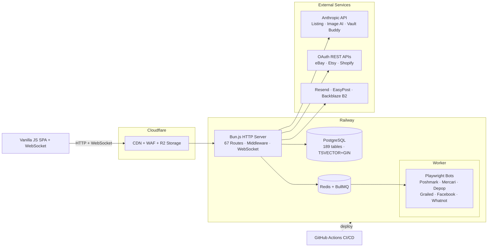

# VaultLister 3.0 — System Architecture Diagram

FigJam: https://www.figma.com/online-whiteboard/create-diagram/ee005b48-d20a-4ae2-a671-4fb46a651547?utm_source=claude&utm_content=edit_in_figjam

## Mermaid Source

